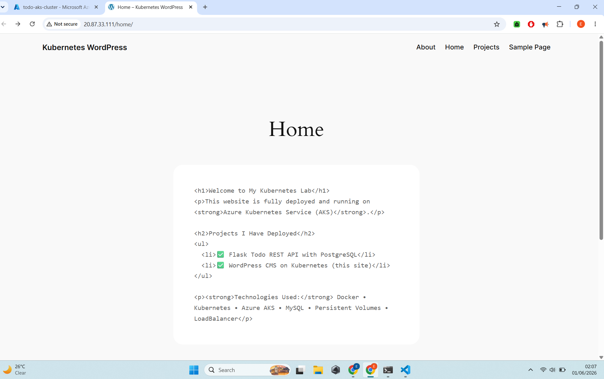
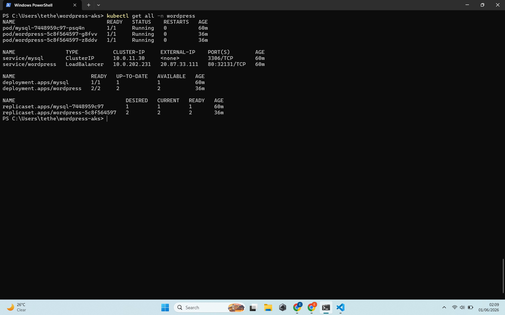
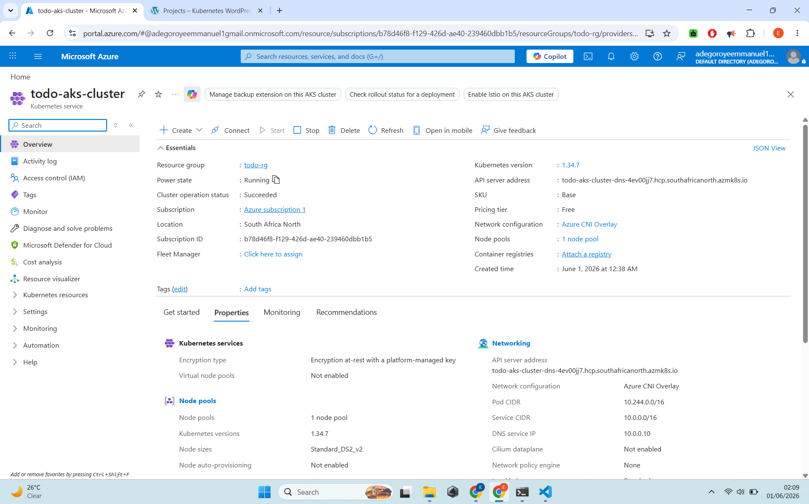

# 🚀 WordPress on Azure Kubernetes Service (AKS)

A complete WordPress CMS deployment on Azure Kubernetes Service demonstrating stateful applications in Kubernetes.



## ✨ Live Demo
**URL:** http://20.87.120.98

## 🛠️ Tech Stack

- **CMS**: WordPress 6.5 (Apache)
- **Database**: MySQL 8.0
- **Orchestration**: Kubernetes on Azure AKS
- **Storage**: PersistentVolumeClaim
- **Access**: LoadBalancer Service

## 📸 Screenshots

  
*Functional WordPress site with custom content*

  
*Pods, Deployments, Services and PVCs running on AKS*

  
*Azure Kubernetes Service Cluster Overview*

## Key Kubernetes Concepts Demonstrated

- StatefulSet vs Deployment
- Persistent Volumes & PVCs for database
- Service discovery (MySQL → WordPress)
- LoadBalancer for external access
- Namespaces for organization

## What I Learned

- Deploying real-world applications on Kubernetes
- Managing persistent data in containers
- Troubleshooting common Kubernetes issues
- Running popular open-source software using official Docker images

## How to Deploy

```bash
kubectl apply -f k8s/
